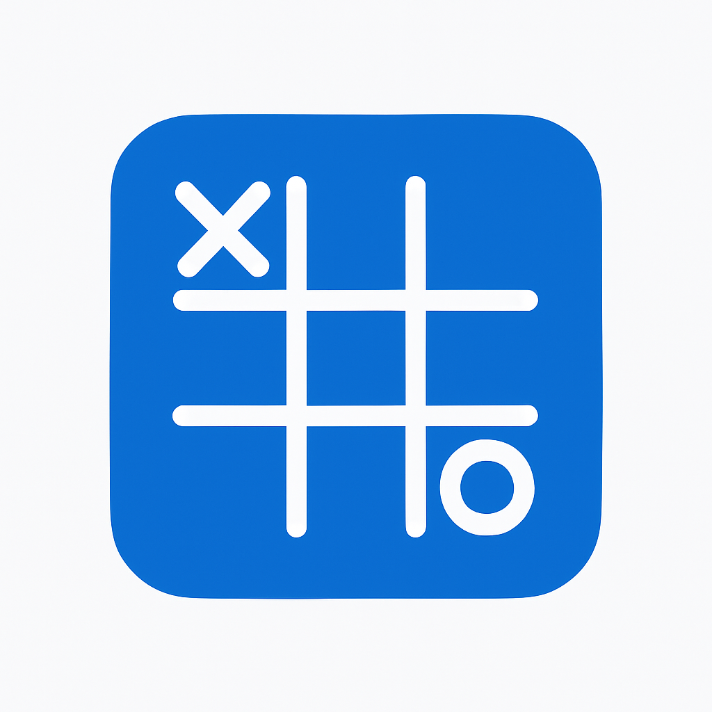

# Tic-Tac-Toe



A simple implementation of the classic Tic-Tac-Toe game.

## To-Do List
- [ ] Implement game logic
- [X] Create a responsive game board
- [X] Add player turn indication
- [X] Detect win conditions
- [X] Implement draw condition
- [ ] Add AI opponent (optional)
- [ ] Improve UI/UX with animations
- [X] Add sound effects

## Features

- Two-player mode
- Clean game board UI
- Responsive design for mobile
- Win/draw detection

## Getting Started

1. Clone the repository:
    ```bash
    git clone https://github.com/yourusername/tic-tac-toe.git
    cd tic-tac-toe
    ```
2. Open `index.html` in your web browser.
3. Alternatively, use a local server:
    ```bash
    python -m http.server
    ```
    Then navigate to `http://localhost:8000` in your browser.
4. Play the game by clicking on the grid to place your X or O.

## Rules

Players take turns marking X and O. The first player to align three of their marks horizontally, vertically, or diagonally wins. If all cells are filled without a winner, the game ends in a draw.

## Contributing

Pull requests are welcome. For major changes, open an issue first.

## License

[MIT](LICENSE)